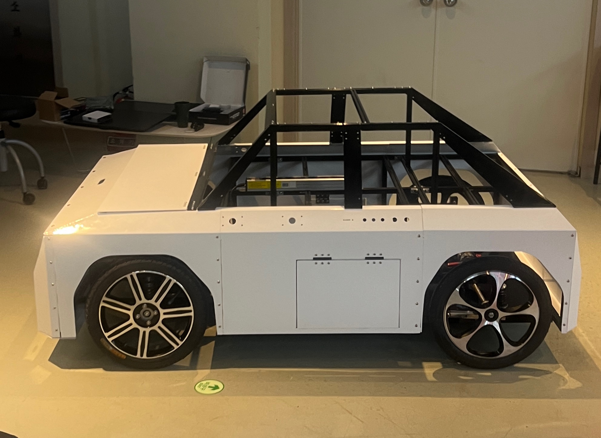
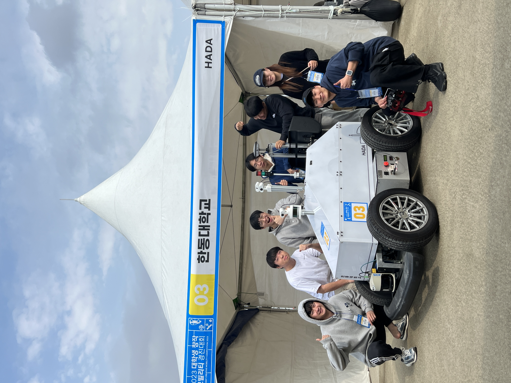
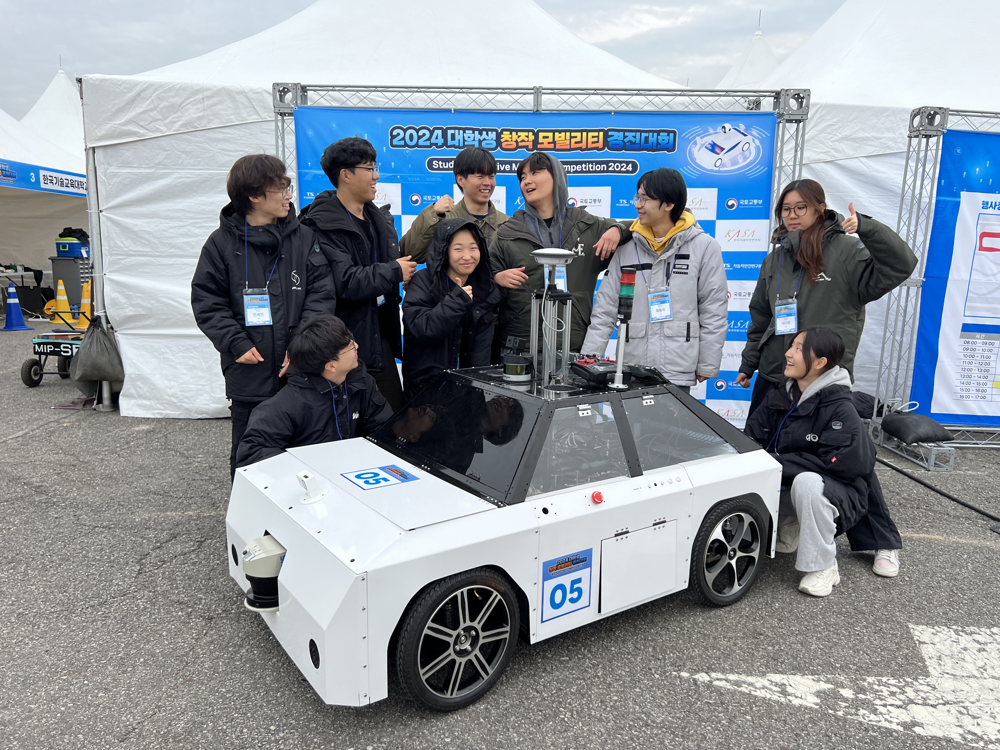

# Team HADA
Name: HADA (Handong Autonomous Driving Avengers)
Every repository is managed under private condition

## Based School of Mechanical and Control Engineering, Handong Global University, Pohang

### Objective
1. Autonomous Vehicle Control
2. Sensor Interface
  * GPS
  * IMU
  * 2D/3D LiDAR
  * Camera
3. Embedded System (Circuit Design/ MCU programming)
4. Situational Awareness

### Equipment

HADA vehicle

1. GPS
2. IMU
3. 2D/3D LiDAR
4. Camera

### Teams

1. Guidance and Navigation
2. Camera
3. LiDAR
4. Main Code
5. Embedded Programming
6. Circuits
7. Hardware design

HADA 3

HADA 4

